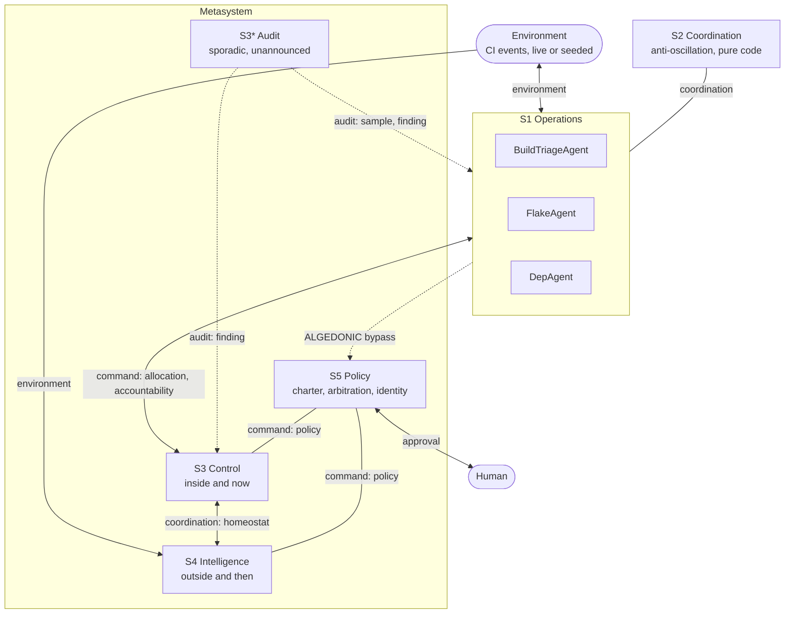

# Architecture

Stafford Beer's Viable System Model claims that any system capable of independent
existence has the same five subsystems, however large or small it is. Operations
do the work, coordination damps their oscillation, control manages the here and
now, intelligence watches the outside and the future, and policy holds identity.
This repo implements that as a running multi-agent orchestrator rather than as a
diagram, and treats the communication topology, not the agents, as the research
object.

## The five systems and the two vertical axes

The solid vertical line from S5 through S3 to S1 is the command axis. The dashed
line from operations straight to S5 is the algedonic bypass, and it is the reason
this repo exists: everything else in the diagram is a hierarchy, and the bypass is
what a hierarchy cannot do.

## The recursion boundary

Every S1 is in principle a viable system containing its own S1 through S5. That
recursion is not implemented, and no interface may preclude it. Two consequences
are already in the code: addresses are path-shaped (`fleet/build_triage_0`) with a
derived level, and the algedonic recipient is resolved as "the metasystem of the
sender's enclosing recursion" rather than hardcoded to the S5 seat. At one level
those are identical; at two they are not, and the second is the one Cybersyn
actually specified.

## Five channels, one of which is the bypass

Beer's First Axiom counts six vertical components of corporate cohesion, plus the
algedonic signal as a separate thing. This implementation uses five channels and
recovers most of what the collapse loses with an `intent` discriminator carried on
every envelope. The collapses are declared here rather than left implicit, because
an undeclared collapse is a confound in the Phase 9 ablation: the repo would be
claiming to ablate the VSM while actually ablating a lossy encoding of it.

| Channel | Beer components collapsed | What is lost | Mitigation |
|---|---|---|---|
| COMMAND | V1 corporate intervention (downward, spends S1 autonomy) + V2 resource bargain and accountability (bidirectional, closed loop) | Interventions cannot be counted separately from allocations, so autonomy erosion becomes unmeasurable, which is exactly the POSIWID signal S3* wants | `intent`: `intervention` vs `allocation` vs `accountability` |
| COORDINATION | V3 S2 anti-oscillation damping + V5 direct S1-to-S1 interconnection | Phase 3's thrash test cannot tell "S2 damped it" from "the S1s sorted it out themselves" | Derived from sender role: sender S2 means damping, otherwise lateral |
| AUDIT | V4, findings direction only | The sporadic sample is a database read, not a message, so S3* becomes the one agent whose channel load is unauditable | Emit the sample request as an AUDIT envelope anyway, before the read |
| ENVIRONMENT | V6 environmental interconnection + the horizontal S1-to-environment loops + S4's total-environment scan | Beer separates S1's local-and-now environment from S4's total-and-future one; different varieties ride one channel here | Derived from sender role, documented, not currently a field |
| ALGEDONIC | The bypass | Beer's algedonic carries pleasure as well as pain, and escalates through recursion levels rather than in one hop | `intent: pain \| pleasure`, and dynamic recipient resolution |

Also collapsed: the S3/S4 homeostat, which Beer treats as the central balance of
the whole model, has no channel of its own here. It rides COORDINATION with
`intent: homeostat` between metasystem roles. Adding a sixth channel would change
the shape of the ablation matrix and the routing-matrix test for one relationship.

## What makes a signal algedonic

Not severity. An ordinary alert travels the normal channels and is handled by the
unit that owns the problem. A signal becomes algedonic when that unit has had a
defined interval to resolve it and has not. That is Cybersyn's rule: the affected
enterprise received the warning first and had an elapse time to fix it, and only a
persisting irregularity escalated upward.

Three consequences for the envelope, all present from Phase 1 so that Phase 6 is
configuration rather than a kernel rewrite: `caused_by` and `root_id` (an
ALGEDONIC envelope with no antecedent is either an immediate signal justified by a
named threshold, or a bug, and the kernel must be able to tell those apart), an
`escalation` record of level, deadline, owner and attempt, and an `index` carrying
the metric, the observed value and the limit it left, because Beer's algedonic
fires when a performance index leaves acceptable limits rather than when an event
happens.

## Determinism contract

The Phase 9 claim is that the ablation table reproduces from seeds. Seeding the
simulator is necessary and not sufficient, so three further commitments hold:

1. Time is injected, never read ambiently. Nothing in `kernel/` calls
   `datetime.now()` or `asyncio.sleep` directly; both go through a `Clock`, and
   the eval harness supplies a virtual one.
2. The runtime advances virtual time only when every agent is blocked on
   `receive()`, and dispatches ready agents in sorted address order. Otherwise the
   winner between two runnable agents is decided by real asyncio scheduling, which
   is precisely what Phase 3's anti-oscillation test needs to be deterministic.
3. `PYTHONHASHSEED=0` in CI and in the eval runner, and ordering-sensitive code
   does not iterate bare sets.

Virtual time cannot compress real model latency, so runs record `sim_duration` and
`wall_clock_duration` as separate columns and Phase 9 reports both.

## Run lifecycle

A run is one bounded execution of one fleet configuration over one event source
with one seed. States: `pending -> running -> draining -> completed | failed |
aborted`. The explicit `draining` state (ingress stopped, queues allowed to empty
under a timeout) is what makes end-of-run message counts deterministic; a drain
that times out means `aborted`, not `completed`, and the reproducibility claim
would otherwise quietly exclude the runs where it failed.

## Storage

Postgres is the system of record. Langfuse is a viewer. Every envelope and every
model call writes a row unconditionally, and tracing never gates a write, so the
algedonic detectors and the POSIWID auditor read a local database rather than a
rate-limited SaaS API. Eval runs disable tracing by default.

Code pointers: [kernel/channels.py](../src/viable_agents/kernel/channels.py) for
the vocabulary, [config/topology/vsm.yaml](../config/topology/vsm.yaml) for the
matrix itself.
